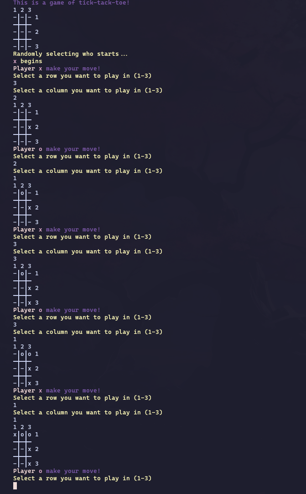

# rust_tack_toe

> [!WARNING]
> This is very unoptimized as it is my first rust project, please do give tips or suggestions!

## Features

You can now play tick tack toe on your CLI, but it's on rust now!

And you also have pretty colors depending on your CLI ones!

## Screenshots

## Download

You can download this little game by first cloning the repo with this command:

    git clone https://github.com/Ezekiel0108/rust_tack_toe.git

Then you can cd inside the folder that you just cloned and run:

    cargo run

And you are all set to play with your friends!.. If you have any...

## Finally

Please remember this is a very dumb project, you can look at it for some inspiration or anything you want,
but it really isn't the best code you could look at, still i hope you have as much fun playing it
or tinkering with the code as much as i had making it!
